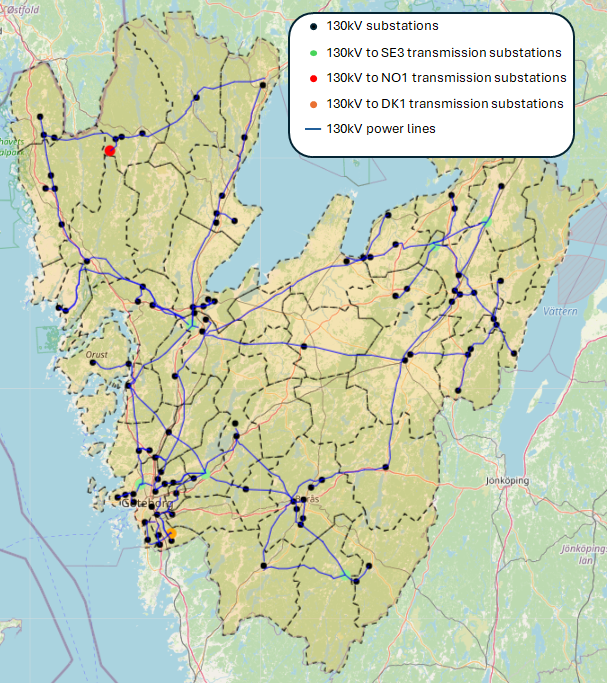

# vgr-model
 Energy Systems Model (ESM) for Västra Götalandsregionen (West Coast), Sweden



# Description
This repository contains scripts in Python and Julia
<br/>
<br/>
Python scripts are intended for the following uses:

- retrieve grid infrastructure data from OpenStreetMap ([retrieve_osm.py](src/retrieve_osm.py))
- clean infrastructure data ([build_elnet.py](src/build_elnet.py))
- assign demand to each substation nodes ([group_demand.py](src/group_demand.py))
- retrieve solar and wind profiles from [Renewables Ninja](https://www.renewables.ninja/) ([get_ninjas.py](src/get_ninjas.py))
- construct voronoi cells for assigning power plants to the substation nodes ([voronoi_subs.py](src/voronoi_subs.py))
<br/>
<br/>
The Julia scripts provide the core optimization of the model <br/>
The model takes input data from ```\modelinput```, which currently still is dummy data <br/>
As the script name suggests, each script contains the following:

+ main script to run the model ([rm_Main.jl](src/rm_Main.jl))
+ read input data and define Sets and Paramaters of the model ([rm_Params_Sets.jl](src/rm_Params_Sets.jl))
+ define Variables and Constraints of the model ([rm_Vars_Consts.jl](src/rm_Vars_Consts.jl))
+ functions for other uses ([rm_Utilities.jl](src/rm_Utilities.jl))
